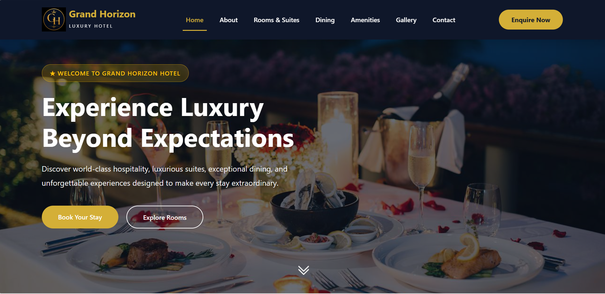
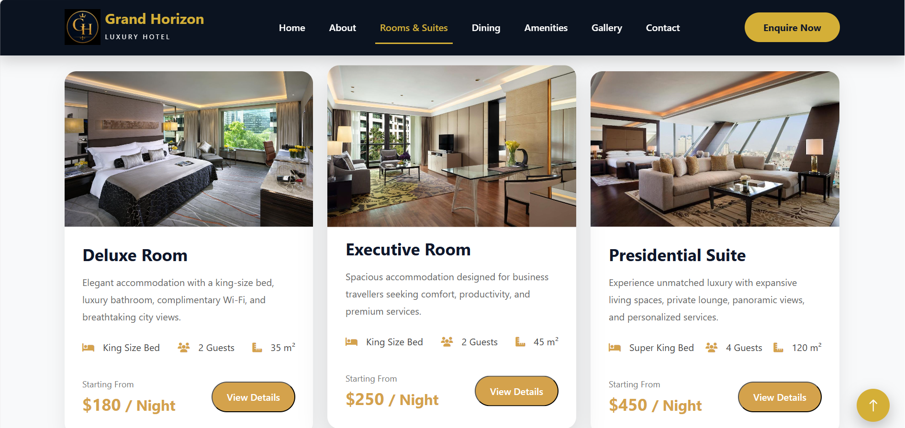
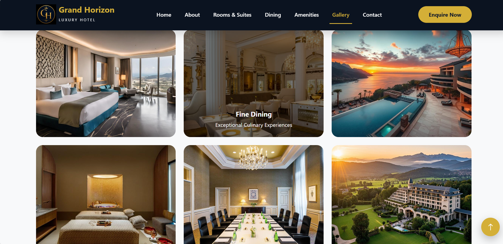
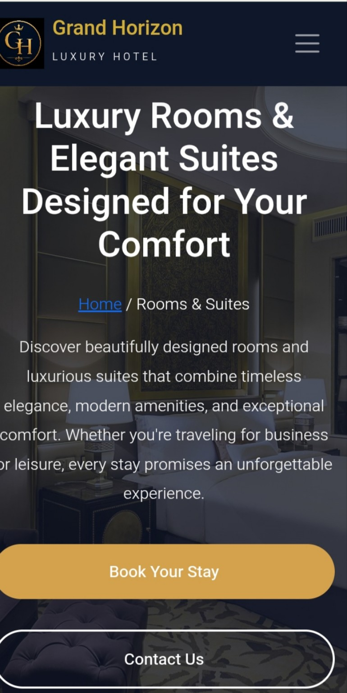

# 🏨 Grand Horizon Luxury Hotel

## 📖 Overview

Grand Horizon Luxury Hotel is a modern, responsive hotel website designed to showcase premium accommodations, luxury amenities, and an exceptional guest experience. The website features an elegant interface, intuitive navigation, and a fully responsive design to ensure seamless browsing across desktop, tablet, and mobile devices.

---

## ✨ Key Features

- Elegant and modern hotel landing page
- Fully responsive design
- Luxury room showcase
- Services and amenities section
- Guest testimonials
- Contact form
- Smooth scrolling navigation
- Clean and professional user interface

---

## 🛠️ Technologies Used

- HTML5
- CSS3
- Bootstrap 5
- JavaScript

---

## 🚀 Live Demo

🌐 **Live Website:**  
https://grand-horizon-luxury-hotel.vercel.app

---

## 📸 Screenshots

### 🏨 Homepage



---

### 🛏️ Rooms



---

### 🖼️ Gallery



---

### 📱 Mobile View



---

## 📂 Project Structure

```text
grand-horizon-luxury-hotel/
├── css/
├── images/
├── js/
├── screenshots/
├── index.html
├── README.md
└── ...
```

---

## 🚀 Future Improvements

- Online room booking functionality
- Room availability checker
- Payment gateway integration
- Customer authentication
- Dynamic room management
- Backend integration

---

## 👨‍💻 Author

**Felix Nkanu**

- **Email:** felixnkanu636@gmail.com
- **Portfolio:** [Visit My Portfolio](https://my-portfolio-website-psi-one.vercel.app/)
- **LinkedIn:** [Felix Nkanu](https://www.linkedin.com/in/felix-nkanu/)
- **GitHub:** [Felix-Nkanu](https://github.com/Felix-Nkanu)
